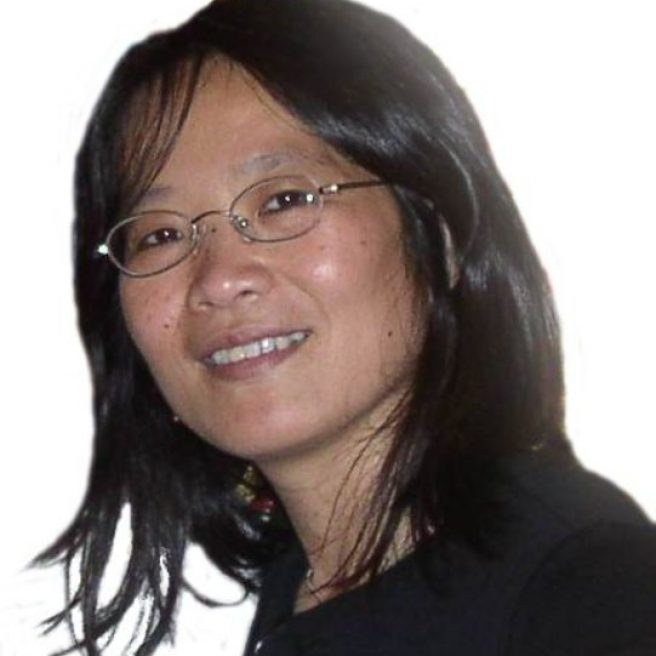

# Mei-Yuh Hwang
 [Affiliate Professor at EE Department](https://www.ece.uw.edu/people/mei-yuh-hwang/), University of Washington (UW).

Mei-Yuh received her PhD in Computer Science from Carnegie Mellon University in 1993 and had worked at Microsoft in U.S. and in China for 20 years,
publishing numerous conference and journal papers, and delivering industry products in speech recognition, machine translation, and language understanding.
Additionally she spent four years at Uiniversity of Washington on Mandarin speech recognition for DARPA EARS and GALE projects during 2004-2008, and four 
years at an AI startup, [Mobvoi](http://www.mobvoi.com), from 2016 through early 2020. She is an IEEE fellow, who is passionate in bridging the gap between 
academia and industry. She is currently with the AI4AR Lab at Meta (formally Facebook).

## Meta, AI Research Scientist @AI4AR, 5/2022--Now
Combining the power of speech, text, and image multi-modality to ease and enrich human life.

## Microsoft Search, Assistant, and Intelligence (MSAI), Seattle WA, 4/2020-4/2022

NLP for Outlook and Teams search, based on fine-tuning on, and/or few-shot prompting to, various large pre-trained language models.

## Mobvoi AI Lab, Seattle WA, 2016-2020
[Mobvoi](http://www.mobvoi.com) makes speech-enabled smart [IoT devices](http://store.ticwear.com), from hardware to software, all in-house. We are one of the most successful companies in smart watches. Mobvoi also
provides the in-car voice assistant for VW automobiles in China. The technology includes both on-the-cloud and on-device voice navigation, enabling majority of
services without internet connection. Though a young company that focuses on industry products, we are actively participating in our speech research 
community with our limited resources. Our publications can be found in [Mobvoi publications](mobvoi/REAMD.md).

## Spoken language understanding for Cortana, Microsoft China, 2012-2015
To deliver non-English language understanding (LU) component for Cortana without human annotated data, Mei-Yuh designed an adapted translation algorithm which offered both paraphrasing and
generalization capabilities with required slot tags. The protoype LU model was further improved via iterative data augmentation using RNN and newly 
logged data. The impressive success of Chinese Cortana gained much attention within China, and sparked the development of personal assistants 
and AI across China.

Mei-Yuh continued to contribute to Microsoft cognitive services:
* Cortana non-English language understanding for [LUIS](https://azure.microsoft.com/en-us/services/cognitive-services/language-understanding-intelligent-service/),
* Language-model adaptation for [customized speech recognition](https://azure.microsoft.com/en-us/services/cognitive-services/custom-speech-service/),
* Spontaneous speech recogition for [Skype speech-to-speech translation](https://www.techlicious.com/blog/skype-translator-preview-app-launch/).

## Speech recognition and machine translation at Microsoft and UW, WA, 1994-2012
As one of the main authors of Sphinx-II, Mei-Yuh ported SPHIX-II to Microsoft on Windows desktop, Office, and Microsoft Speech Server SDK, for the speech recognition of multiple languages during 1994-2004.

From 2004-2008, Mei-Yuh led the DARPA EARS and GALE Mandarin speech recongition projects at University of Washington (UW). 
Her [IEEE paper](https://ieeexplore.ieee.org/document/5165110) was a gold reference guide on building a high-quality Mandarin speech recognizer.

In 2008-2012, She co-built Bing Translator automated training infrastructure, including the design and implementation of map-reduce parallel
processing, based on [DryadLink](https://www.microsoft.com/en-us/research/project/dryadlinq/). She further designed and 
implemented [Bing Translation Hub](https://www.microsoft.com/en-us/translator/business/customization/) for customized vertical-domain translation.

## SPHINX-II speech recognition at CMU, PA, 1987-1993
Mei-Yuh was the first to propose Markov state clustering based on decision trees for continuous speech recognition. The idea of shared states
(or [senones](https://ieeexplore.ieee.org/document/225979/) as Mei-Yuh named it in 1992) had been widely adopted for two decades since its inception, until recent years when end-to-end neural-based speech recognition such as RNN-T and transformers is gaining ground.

## Awards
* 2019, IEEE Fellow
* 2010, Microsoft Gold Star Award from Microsoft Research, Redmond, WA
* 1992, Allen Newell Research Excellence Medal, Pittsburgh, Carnegie Mellon University
* 1986, [Phi Tao Phi Scholastic Honor Society](http://www.phitauphi.org.tw/), recommended by National Taiwan University

## Invited Talks
* 2020: WeCNLP Summit, Seattle online.
* 2019: Northwestern Polytechnical University, Xi-an, China
* 2018 April: Yuanchuan Telephony company, Taiwan
* 2017: [UWEE Research Colloquium Talk](https://www.youtube.com/watch?v=iVnBcGXBs3w)
* 2017: Panelist, [CMU Summit](https://cmu-summit.net/past-summits/)
* 2017: Talk at Southwest Forestry Univerisity, Kunming, China
* 2017: Talk at Soochow University, Suzhou, China
* 2015: Talk at Soochow University, Suzhou, China
* 2014: Talk at University of Science and Technology of China, Suzhou campus
* 2014: Keynote speech at PhD Forum, Northwestern Polytechnical University, Xi-an, China
* 1994-2003: Lecturer at National Taiwan University, Academia Sinica, and ITRI, Taiwan
* 1993: Lecturer at IBM Gaithersburg

## [Google Scholar](https://scholar.google.com/scholar?hl=en&as_sdt=0%2C5&q=mei-yuh+hwang&btnG=&oq=mei-yuh+hwang)

## Education
* PhD, Computer Science, Carnegie Mellon University, December 1993.
* BA, Computer Science, National Taiwan University, June 1986.

